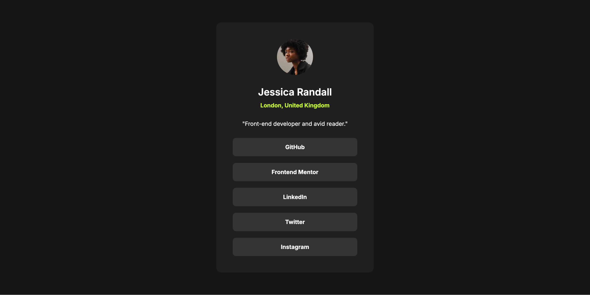
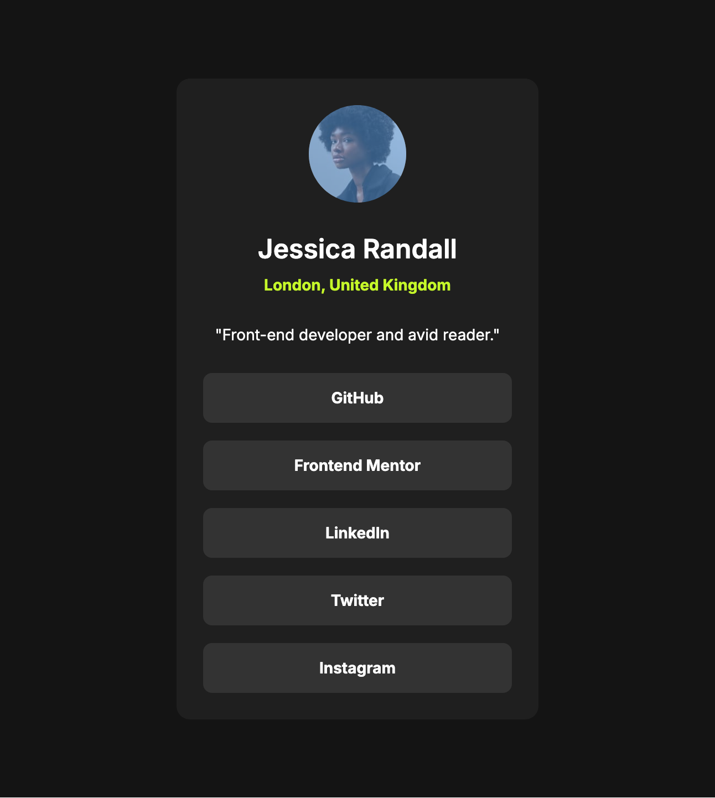

# Frontend Mentor - Social links profile solution

This is a solution to the [Social links profile challenge on Frontend Mentor](https://www.frontendmentor.io/challenges/social-links-profile-UG32l9m6dQ). Frontend Mentor challenges help you improve your coding skills by building realistic projects.

## Table of contents

- [Overview](#overview)
  - [The challenge](#the-challenge)
  - [Screenshot](#screenshot)
  - [Links](#links)
- [My process](#my-process)
  - [Built with](#built-with)
  - [What I learned](#what-i-learned)
  - [Continued development](#continued-development)
  - [AI Collaboration](#ai-collaboration)
- [Author](#author)
- [Acknowledgments](#acknowledgments)

## Overview

### The challenge

Users should be able to:

- See hover and focus states for all interactive elements on the page

### Screenshot




### Links

- Solution URL: [Add solution URL here](https://github.com/Kristina2025/fm3-social-links-profile-main)
- Live Site URL: [Add live site URL here](https://fm3-social-links-profile-main.netlify.app/)

## My process

### Built with

- Semantic HTML5 markup
- CSS custom properties
- Flexbox
- Mobile-first workflow

### What I learned

I mostly practiced the suggestions made on my prevois solution regarding the best way to use custom fonts to deal with FOIT (Flash of Invisible Text) and FOUT (Flash of Unstyled Text), add width and height to my images to avoid CLS (cumulative layout shifts). I also used BEM naming, tried to make my site more responsive and used the mobile-first approach.
The main problem I encountered was related to CSS specificity:
I added a hover state on a list item and wanted to change both the background color of the link and the text color of the anchor. The text color didn’t change because the anchor had its own color and didn’t inherit from its parent. I solved this by targeting the anchor element when the list item is hovered:

```css
.card__links-li:hover .card__links-a {
  color: var(--color-bg-grey-700);
}
```

### Continued development

1. I need to learn more about CSS specificity and inheritance.
2. I used a mobile-first approach with media queries for this project. I want to learn about clamp() in CSS.

### AI Collaboration

I used ChatGPT for:

- concept clarification (FOIT, FOUT, bandwidth, clamp)
- CSS debugging help (hover selectors, media queries)
- general frontend explanations

I didn't use to write the code for me, I don't think that's a good use for it at this stage since I'm still learning the basics.

## Author

- Frontend Mentor - [@yourusername](https://www.frontendmentor.io/profile/Kristina2025)

## Acknowledgments

Elmar Chavez (https://www.frontendmentor.io/profile/CodingWithJiro) gave me a lot of helpful feedback on my previous project. I implemented this solution by taking into account all of his suggestions.
